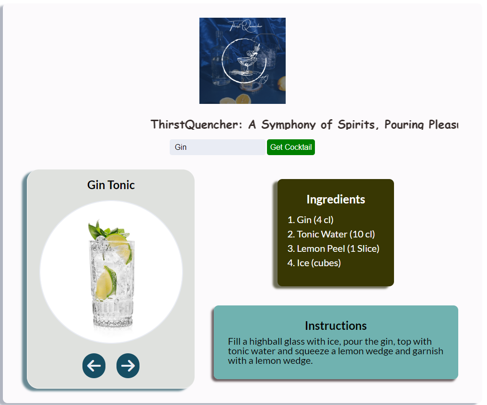

<h1 align="center">ThrustQuencher</h1>

  

[ThristQuencher](https://thristquencher.netlify.app/) ThirstQuencher stands as your ultimate cocktail companion, seamlessly enabling you to explore a myriad of cocktails with detailed recipes, ingredients, captivating visuals, and all the essentials to elevate your mixology skills from the comfort of your home. Simply initiate a search for your desired cocktail, and let the journey to mastering mixology unfold before you

## Features
- Search for a cocktail
- Get ingredients & measurements
- Get instructions
- Automatic carousel which rotates through all the drinks that matched the search query (if more than one)
- User can click arrows to go to previous and next drinks

## Incoming Features
- Mobile responsive styling

## Live Site
Live Site [Here](https://thristquencher.netlify.app/)

## Resources
- API: [thecocktailDB](https://www.thecocktaildb.com/api.php)

